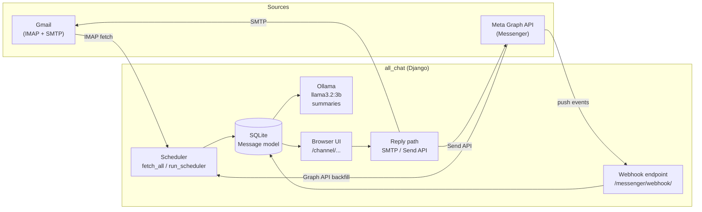
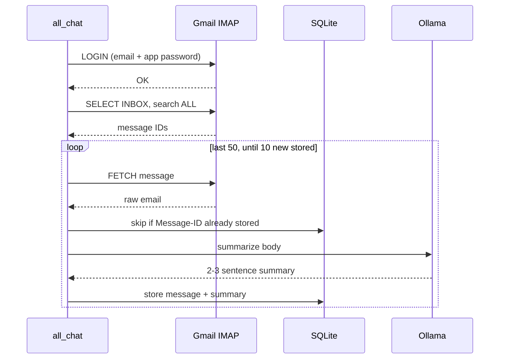
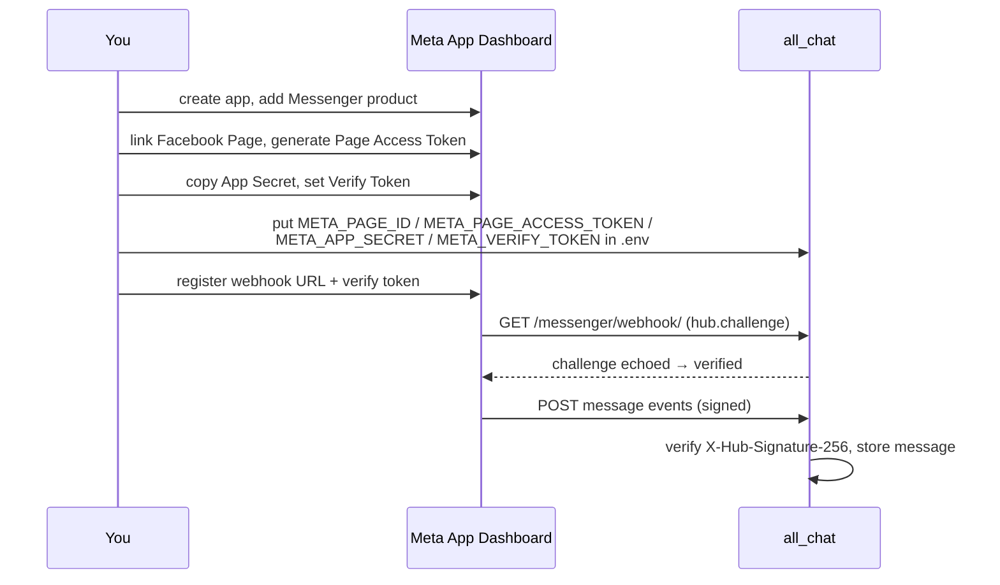
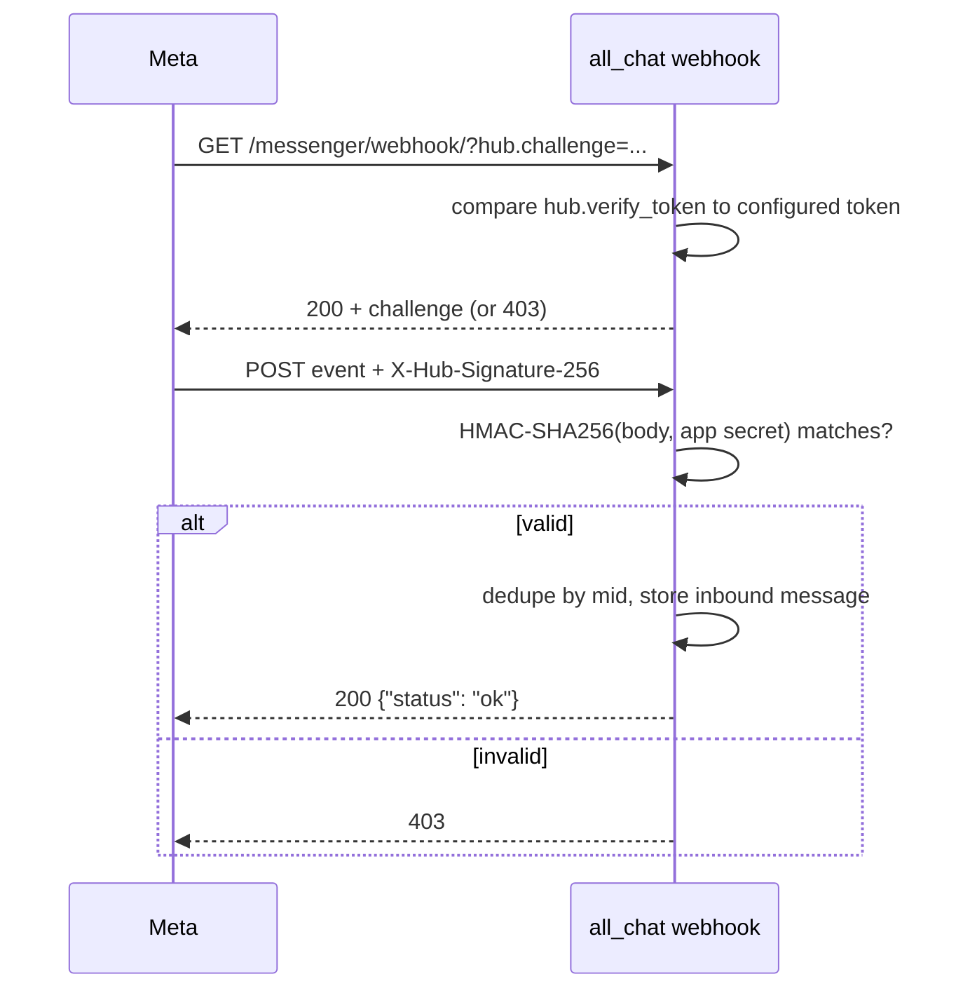
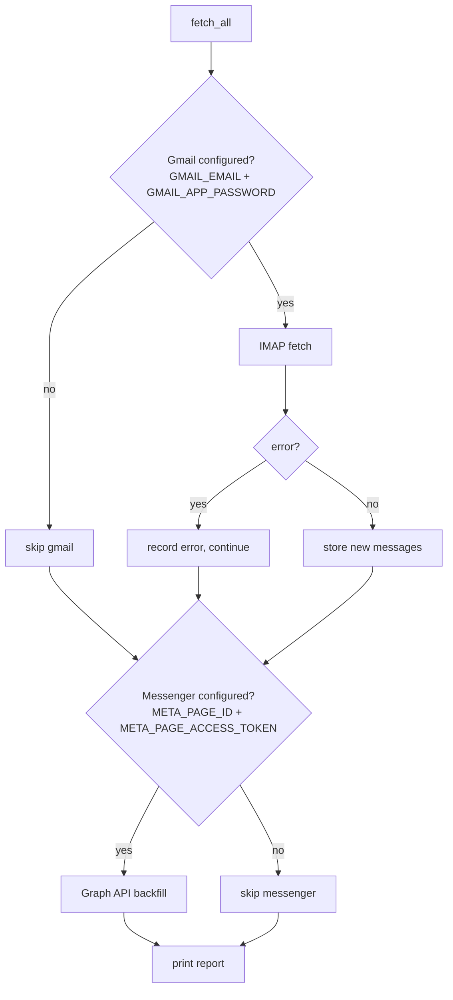
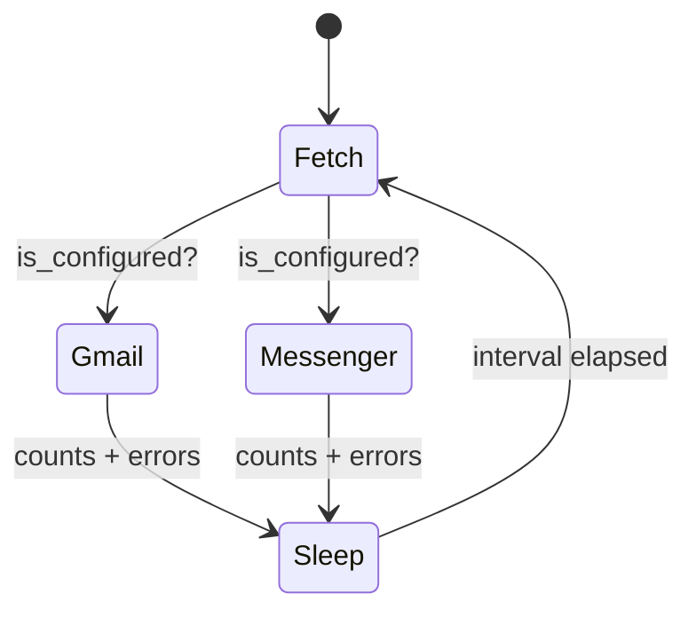
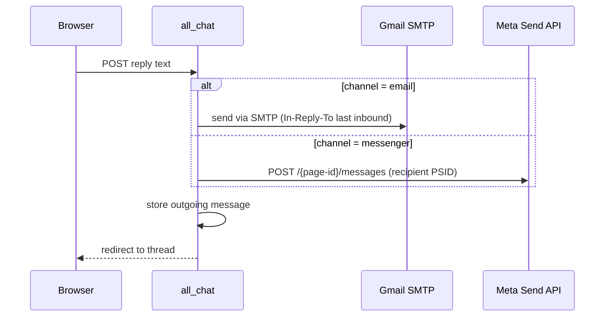
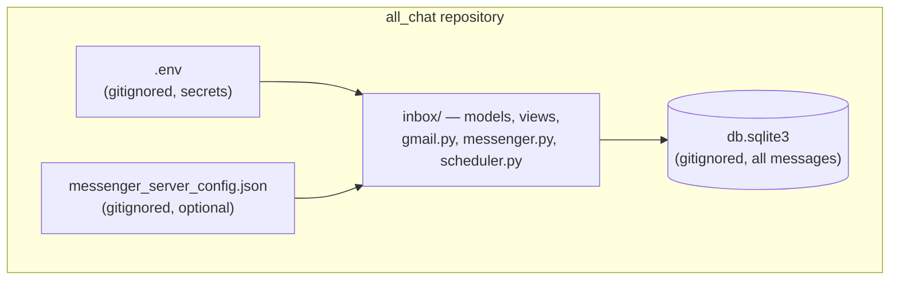

# Setup Guide

Detailed setup instructions for **all_chat** (Unified Inbox): a Django app that pulls Gmail and Facebook Messenger messages into one dashboard, summarizes them locally with Ollama, and lets you reply from the browser.

## Table of Contents

- [Architecture Overview](#architecture-overview)
- [Prerequisites](#prerequisites)
- [Step 1 — Install and Run](#step-1--install-and-run)
- [Step 2 — Gmail Setup](#step-2--gmail-setup)
- [Step 3 — Messenger Setup](#step-3--messenger-setup)
- [Step 4 — Automate Fetching](#step-4--automate-fetching)
- [Step 5 — Use the App](#step-5--use-the-app)
- [Troubleshooting](#troubleshooting)

## Architecture Overview

Everything runs from server-side credentials. A scheduler (cron or the built-in poller) pulls messages in; the Messenger webhook pushes them in real time.



## Prerequisites

| Requirement | Notes |
|---|---|
| Python 3.12+ | Tested on 3.12 |
| [Ollama](https://ollama.com) | Local LLM for summaries |
| Gmail account with 2FA | Needed to create an app password |
| Facebook Page | Messenger works through Pages, not personal chats |
| Meta Developer App | For the Messenger Graph API + webhook |

## Step 1 — Install and Run

```bash
git clone https://github.com/Phurba2/all_chat.git
cd all_chat
python3 -m venv .venv
.venv/bin/pip install -r requirements.txt
.venv/bin/python manage.py migrate
```

Install Ollama and pull the summarization model:

```bash
ollama pull llama3.2:3b
```

Create your `.env` (never committed — it is gitignored):

```bash
# Gmail
GMAIL_EMAIL=you@gmail.com
GMAIL_APP_PASSWORD=abcdefghijklmnop

# Messenger
META_PAGE_ID=your-page-id
META_PAGE_ACCESS_TOKEN=your-page-access-token
META_APP_SECRET=your-app-secret
META_VERIFY_TOKEN=a-string-you-invent
META_GRAPH_VERSION=v26.0
```

Start the server:

```bash
.venv/bin/python manage.py runserver
```

Open http://127.0.0.1:8000 — you land on the Messenger inbox view.

## Step 2 — Gmail Setup

The app talks to Gmail over IMAP (read) and SMTP (send), authenticated with an **app password** — a 16-character password separate from your Google login.



### 2.1 Generate the app password

1. Go to your Google Account → **Security**.
2. Enable **2-Step Verification** (required for app passwords).
3. Search for **App passwords** (or visit myaccount.google.com/apppasswords).
4. Create one, e.g. name `all_chat`. Google shows 16 characters like `gjwo uxuu bbnm przx`.
5. Copy it into `.env` as `GMAIL_APP_PASSWORD` (spaces are fine — the app strips them when logging in via IMAP, which tolerates them; but prefer pasting it without spaces to be safe).

### 2.2 Configure and verify

Make sure `GMAIL_EMAIL` and `GMAIL_APP_PASSWORD` are in `.env`, then test with a real (idempotent) fetch:

```bash
.venv/bin/python manage.py fetch_gmail
# Stored N new email(s).
```

Run it again — it stores 0, because already-fetched `Message-ID`s are skipped.

### 2.3 How it's scoped

Emails are stored with `user_email` = the configured address; the inbox view groups conversations by sender address.

## Step 3 — Messenger Setup

Messenger messages flow through your Facebook **Page**. You need a Meta developer app with the Messenger product and a Page access token.



### 3.1 Create the Meta app

1. Go to [developers.facebook.com/apps](https://developers.facebook.com/apps) → **Create App** → type **Business**.
2. Add the **Messenger** product.
3. In Messenger settings, link your Facebook Page and generate a **Page Access Token** (choose the Page, grant `pages_messaging`).
4. Note down:
   - `META_PAGE_ID` — the numeric Page ID
   - `META_PAGE_ACCESS_TOKEN` — the long-lived token
   - `META_APP_SECRET` — App settings → Basic
   - `META_VERIFY_TOKEN` — any string you invent; both sides must match

### 3.2 Store credentials

Either in `.env` (shown above) or in a gitignored `messenger_server_config.json` — values saved there take precedence over env vars:

```json
{
  "META_PAGE_ID": "1234567890",
  "META_PAGE_ACCESS_TOKEN": "EAAG...",
  "META_APP_SECRET": "abc123...",
  "META_VERIFY_TOKEN": "my-verify-token"
}
```

### 3.3 Register the webhook

For local development, expose the app with a tunnel:

```bash
ngrok http 8000
```

In the Meta app → Messenger → **Webhooks**:

- **Callback URL**: `https://<your-domain>/messenger/webhook/`
- **Verify token**: the exact `META_VERIFY_TOKEN` value
- Subscribe to the **messages** field.

Meta then verifies ownership and starts pushing events:



### 3.4 Backfill existing conversations

The webhook only delivers *new* events. To import recent history:

```bash
.venv/bin/python manage.py fetch_messenger
```

Safe to repeat — stored message IDs are skipped.

## Step 4 — Automate Fetching

Two ways to keep the inbox current:

### Option A — cron (recommended for servers)

```bash
*/5 * * * * cd /path/to/all_chat && .venv/bin/python manage.py fetch_all --quiet >> /var/log/all_chat.log 2>&1
```

`fetch_all` runs one pass over every configured channel; `--quiet` only prints when something was fetched or an error occurred. Channels are isolated — a Gmail outage never blocks Messenger fetching:



### Option B — built-in poller (no cron needed)

```bash
.venv/bin/python manage.py run_scheduler                 # default: every 60s
.venv/bin/python manage.py run_scheduler --interval 30   # every 30s
export FETCH_INTERVAL_SECONDS=120                        # or via env
```

Run it under a process manager in production:

```ini
# /etc/systemd/system/all_chat-scheduler.service
[Unit]
Description=all_chat message scheduler
After=network.target

[Service]
WorkingDirectory=/path/to/all_chat
ExecStart=/path/to/all_chat/.venv/bin/python manage.py run_scheduler
Restart=always
User=youruser

[Install]
WantedBy=multi-user.target
```

Then: `sudo systemctl enable --now all_chat-scheduler`.



## Step 5 — Use the App

| URL | What it shows |
|---|---|
| `/` | Redirects to the Messenger channel |
| `/channel/email/` | Gmail conversations |
| `/channel/messenger/` | Messenger conversations |
| `/channel/<channel>/<contact>/` | One thread, with the reply bar |
| `/messenger/webhook/` | Meta-only endpoint |

Replies: email goes out via SMTP (`smtp.gmail.com:465`), Messenger via the Graph API Send API. Outgoing messages are stored locally too, so threads show both sides. Opening a thread marks its incoming messages as read.



## Troubleshooting

| Symptom | Likely cause / fix |
|---|---|
| `Gmail fetch failed: [AUTHENTICATIONFAILED]` | Wrong app password, or it was revoked — regenerate at myaccount.google.com/apppasswords |
| `Gmail is not configured server-side` | `GMAIL_EMAIL` / `GMAIL_APP_PASSWORD` missing from env; check `grep GMAIL .env` |
| `Messenger is not configured` | `META_PAGE_ID` / `META_PAGE_ACCESS_TOKEN` missing (env or `messenger_server_config.json`) |
| Webhook verification fails (403) | `META_VERIFY_TOKEN` in Meta dashboard must exactly match the configured value |
| Webhook POSTs rejected (403) | `META_APP_SECRET` mismatch — signature check fails |
| No summaries appear | Ollama not running or `llama3.2:3b` not pulled — run `ollama list` |
| Duplicate-looking messages | None are stored twice: unique constraint on `(channel, user_email, message_id)` |
| `FETCH_INTERVAL_SECONDS must be an integer` | Set a number of seconds, e.g. `FETCH_INTERVAL_SECONDS=60` |

### Where things live


